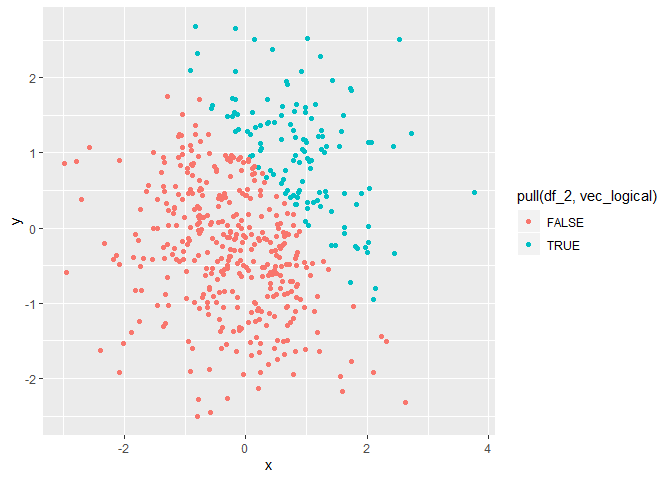
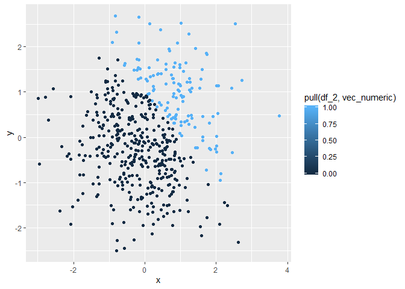
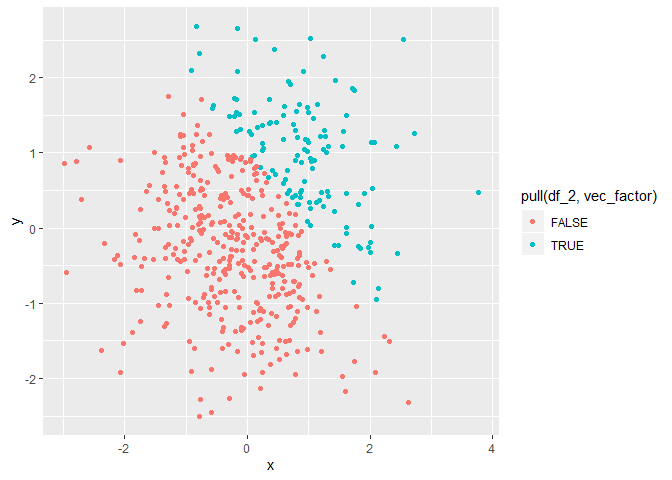

p8105\_hw1\_yl4359
================
Yue Lai
9/16/2019

# Problem 1

Create a data frame comprised of:

  - a random sample of size 8 from a standard Normal distribution

  - a logical vector indicating whether elements of the sample are
    greater than 0

  - a character vector of length 8

  - a factor vector of length 8, with 3 different factor “levels”

<!-- end list -->

``` r
df_1 = tibble(
  vec_norm = rnorm(8),
  vec_logical = vec_norm > 0,
  vec_char = c("apple","banana", "orange", "pineapple", "cherry", "buleberry", "strawberry", "watermelon"),
  vec_factor = factor(c("dislike", "so so", "so so", "like", "dislike", "like", "like", "like"))
)
```

Convert logical, character and factor variables to numeric variable.

``` r
as.numeric(pull(df_1, vec_logical))
as.numeric(pull(df_1, vec_char))
as.numeric(pull(df_1, vec_factor))
```

In a second code chunk:

  - convert the logical vector to numeric, and multiply the random
    sample by the result

  - convert the logical vector to a factor, and multiply the random
    sample by the result

  - convert the logical vector to a factor and then convert the result
    to numeric, and multiply the random sample by the
    result

<!-- end list -->

``` r
as.numeric(pull(df_1, vec_logical))*pull(df_1, vec_norm)
```

    ## [1] 0.01496946 0.00000000 0.00000000 0.04309560 0.43712337 0.00000000
    ## [7] 0.00000000 0.06554429

``` r
as.factor(pull(df_1, vec_logical))*pull(df_1, vec_norm)
```

    ## Warning in Ops.factor(as.factor(pull(df_1, vec_logical)), pull(df_1,
    ## vec_norm)): '*' not meaningful for factors

    ## [1] NA NA NA NA NA NA NA NA

``` r
as.numeric(as.factor(pull(df_1, vec_logical)))*pull(df_1, vec_norm)
```

    ## [1]  0.02993892 -1.32383258 -0.74429658  0.08619121  0.87424674 -0.16392844
    ## [7] -1.65195827  0.13108857

# Problem 2

Create a data frame comprised of:

  - x: a random sample of size 500 from a standard Normal distribution

  - y: a random sample of size 500 from a standard Normal distribution

  - A logical vector indicating whether x + y \> 1

  - A numeric vector created by coercing the above logical vector

  - A factor vector created by coercing the above logical vector

<!-- end list -->

``` r
df_2 = tibble(
  x = rnorm(500),
  y = rnorm(500),
  vec_logical = (x + y) > 1,
  vec_numeric = as.numeric(vec_logical),
  vec_factor = as.factor(vec_logical)
)
```

  - The size of the dataset is 500 rows and 5 columns.

  - The mean of x is 0.0271186.

  - The median of x is 0.0466322.

  - The standard deviation of x is 0.9987053.

  - The proportion of cases for which x + y \> 1 is 0.25.

Make a scatterplot of y vs x; color points using the logical variable.
Make a second and third scatterplot that color points using the numeric
and factor variables, respectively, and comment on the color scales.

Export the first scatterplot to the project
directory.

``` r
ggplot(df_2, aes(x = x, y = y, color = pull(df_2, vec_logical))) + geom_point()
```

<!-- -->

``` r
ggsave("hw1_plot", device = "jpeg", path =  "C:/Users/16462/Documents/Columbia/P8105/Homework/p8105_hw1_yl4359")
```

    ## Saving 7 x 5 in image

``` r
ggplot(df_2, aes(x = x, y = y, color = pull(df_2, vec_numeric))) + geom_point()
```

<!-- -->

``` r
ggplot(df_2, aes(x = x, y = y, color = pull(df_2, vec_factor))) + geom_point()
```

<!-- -->
